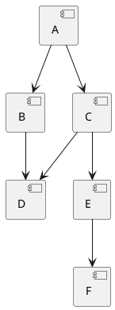

# Визуализатор графа зависимостей для Ubuntu (apt)

**Кирюшин Артём ИКБО-51-24**  
**Вариант №11**

---

## Описание

Инструмент для анализа и визуализации графа зависимостей пакетов Ubuntu (apt). Позволяет строить граф транзитивных зависимостей, находить обратные зависимости, определять порядок загрузки и визуализировать результаты.

---

## Этап 1. Минимальный прототип с конфигурацией

Реализован CLI-инструмент с загрузкой конфигурации из INI-файла и валидацией всех параметров.

### Настраиваемые параметры

- `package_name` — имя анализируемого пакета (строка)
- `repository_url` — URL репозитория или путь к файлу тестового репозитория (строка)
- `test_mode` — режим работы с тестовым репозиторием: `true` или `false` (булево)
- `package_version` — версия Ubuntu (например, `focal`, `jammy`) (строка)
- `ascii_tree` — режим вывода зависимостей в формате ASCII-дерева: `true` или `false` (булево)
- `max_depth` — максимальная глубина анализа зависимостей (целое число ≥ 0)
- `filter_substring` — подстрока для фильтрации пакетов (строка, может быть пустой)

Все параметры обязательны. При ошибках в конфигурации выводится понятное сообщение.

### Пример конфигурации (config.ini)

```ini
[settings]
package_name = curl
repository_url = http://archive.ubuntu.com/ubuntu
test_mode = false
package_version = focal
ascii_tree = true
max_depth = 2
filter_substring = 
```

### Запуск

```bash
python main.py config.ini
```

При запуске приложение выводит все параметры конфигурации в формате `ключ = значение`.

---

## Этап 2. Сбор данных

Реализована логика получения **прямых зависимостей** пакета Ubuntu **без использования менеджеров пакетов**.

### Особенности реализации

- Поддерживаются два режима работы:
  - **Реальный репозиторий** (`test_mode = false`): загружается файл `Packages.gz` из указанного репозитория Ubuntu
  - **Тестовый репозиторий** (`test_mode = true`): читается локальный JSON-файл с описанием зависимостей
  
- Для реального репозитория:
  - URL формируется как: `{repository_url}/dists/{package_version}/main/binary-amd64/Packages.gz`
  - Файл скачивается, распаковывается и парсится
  - Извлекаются зависимости из поля `Depends`
  - Обрабатываются альтернативные зависимости (берется первый вариант)
  - Убирается информация о версиях

- Реализована обработка ошибок:
  - HTTP-ошибки (404, 500 и т.д.)
  - Ошибки сети
  - Ошибки распаковки
  - Некорректные данные

### Пример вывода

```
Прямые зависимости пакета curl:
  libc6
  libcurl4
  zlib1g
```

---

## Этап 3. Основные операции

Реализовано построение графа транзитивных зависимостей с использованием **алгоритма BFS с рекурсией**.

### Особенности реализации

- **Алгоритм**: BFS (поиск в ширину) с рекурсией
- **Максимальная глубина**: анализ проводится с учетом параметра `max_depth`
- **Фильтрация**: пакеты, содержащие подстроку `filter_substring` в имени, исключаются из анализа
- **Циклические зависимости**: обрабатываются корректно через отслеживание посещенных пакетов
- **Тестовый режим**: поддерживается работа с локальным JSON-файлом

### Формат тестового репозитория (test_repo.json)

```json
{
  "A": ["B", "C"],
  "B": ["D"],
  "C": ["D", "E"],
  "D": [],
  "E": ["F"],
  "F": []
}
```

### Пример конфигурации для тестирования

```ini
[settings]
package_name = A
repository_url = test_repo.json
test_mode = true
package_version = focal
ascii_tree = true
max_depth = 3
filter_substring = 
```

---

## Этап 4. Дополнительные операции

Реализованы два режима анализа:

### 1. Обратные зависимости

Показывает пакеты, которые зависят от указанного пакета.

### 2. Порядок загрузки зависимостей

Определяет правильный порядок установки пакетов с использованием топологической сортировки.

### Пример вывода

```
Обратные зависимости для D:
  B
  C

Порядок загрузки зависимостей:
  A
  B
  C
  D
  E
  F
```

---

## Этап 5. Визуализация

Реализовано два способа визуализации:

### 1. PlantUML диаграмма

Генерируется текстовое представление графа на языке PlantUML.

Пример вывода:



Для получения изображения можно использовать онлайн-сервис [PlantUML](http://www.plantuml.com/plantuml/) или локальную установку PlantUML.

### 2. ASCII-дерево

При установке параметра `ascii_tree = true` выводится дерево зависимостей в текстовом формате.

Пример вывода:

```
ASCII-дерево зависимостей:
└── A
    ├── B
    │   └── D
    └── C
        ├── D
        └── E
            └── F
```

---

## Требования

- Python 3.7+
- Стандартная библиотека Python (не требуется установка дополнительных пакетов)

---

## Примеры использования

### Пример 1: Анализ реального пакета

```ini
[settings]
package_name = nginx
repository_url = http://archive.ubuntu.com/ubuntu
test_mode = false
package_version = focal
ascii_tree = true
max_depth = 1
filter_substring = lib
```

```bash
python main.py config.ini
```

### Пример 2: Тестирование с локальным репозиторием

```ini
[settings]
package_name = A
repository_url = test_repo.json
test_mode = true
package_version = focal
ascii_tree = true
max_depth = 5
filter_substring = 
```

```bash
python main.py config.ini
```

### Пример 3: Анализ с фильтрацией

```ini
[settings]
package_name = python3
repository_url = http://archive.ubuntu.com/ubuntu
test_mode = false
package_version = jammy
ascii_tree = false
max_depth = 2
filter_substring = doc
```

```bash
python main.py config.ini
```

---

## Тестовые файлы

Для тестирования работы инструмента предоставляются следующие файлы:

- `test_repo.json` — простой граф зависимостей
- `test_repo_cycle.json` — граф с циклическими зависимостями
- `test_repo_complex.json` — сложный граф для проверки алгоритмов

---

## Структура проекта

```
.
├── main.py              # Основной файл программы
├── README.md            # Документация
├── config.ini           # Пример конфигурации
├── test_repo.json       # Тестовый репозиторий
├── test_repo_cycle.json # Тест с циклами
└── test_repo_complex.json # Сложный тест
```

---

## Обработка ошибок

Инструмент обрабатывает следующие типы ошибок:

- Отсутствие файла конфигурации
- Некорректные параметры конфигурации
- Ошибки сети при загрузке данных
- Отсутствие пакета в репозитории
- Некорректный формат данных репозитория
- Ошибки при парсинге зависимостей

Все ошибки выводятся в `stderr` с понятными сообщениями.

---

## Сравнение с штатными инструментами

Результаты работы инструмента были сравнены с:
- `apt-cache depends` — для получения прямых зависимостей
- `apt-rdepends` — для анализа транзитивных зависимостей

### Возможные расхождения

1. **Альтернативные зависимости**: инструмент всегда выбирает первый вариант, в то время как apt может выбрать другой
2. **Виртуальные пакеты**: не обрабатываются в текущей версии
3. **Рекомендованные зависимости**: не учитываются (только обязательные)
4. **Версии пакетов**: инструмент игнорирует ограничения по версиям

---

## Автор

**Кирюшин Артём**  
Группа: ИКБО-51-24  
Вариант: №11  
Дисциплина: Конфигурационное управление  
РТУ МИРЭА — 2025