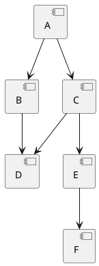

# Визуализатор графа зависимостей для Ubuntu (apt)# Визуализатор графа зависимостей для Ubuntu (apt)


**Автор:** Кирюшин Артём, ИКБО-51-24  **Кирюшин Артём ИКБО-51-24**  

**Вариант:** №11**Вариант №11**


## 🚀 Быстрый старт---


```bash## Описание

# Запуск с конфигурацией по умолчанию

python main.py config.iniИнструмент для анализа и визуализации графа зависимостей пакетов Ubuntu (apt). Позволяет строить граф транзитивных зависимостей, находить обратные зависимости, определять порядок загрузки и визуализировать результаты.


# Запуск всех примеров---

bash examples/run_all_examples.sh

## Этап 1. Минимальный прототип с конфигурацией

# Генерация визуализаций

bash examples/run_visualizations.shРеализован CLI-инструмент с загрузкой конфигурации из INI-файла и валидацией всех параметров.

```

### Настраиваемые параметры

## 📁 Структура проекта

- `package_name` — имя анализируемого пакета (строка)

```- `repository_url` — URL репозитория или путь к файлу тестового репозитория (строка)

conf_upr/- `test_mode` — режим работы с тестовым репозиторием: `true` или `false` (булево)

├── main.py                     # Основная программа- `package_version` — версия Ubuntu (например, `focal`, `jammy`) (строка)

├── config.ini                  # Базовая конфигурация- `ascii_tree` — режим вывода зависимостей в формате ASCII-дерева: `true` или `false` (булево)

├── configs/                    # Конфигурационные файлы- `max_depth` — максимальная глубина анализа зависимостей (целое число ≥ 0)

│   ├── config_example1.ini    # Простой граф- `filter_substring` — подстрока для фильтрации пакетов (строка, может быть пустой)

│   ├── config_example2.ini    # Циклы

│   ├── config_example3.ini    # ФильтрацияВсе параметры обязательны. При ошибках в конфигурации выводится понятное сообщение.

│   ├── config_visual1.ini     # Визуализация B

│   ├── config_visual2.ini     # Визуализация C### Пример конфигурации (config.ini)

│   ├── config_visual3.ini     # Визуализация D

│   └── config_real.ini        # Реальный репозиторий```ini

├── tests/                      # Тестовые данные[settings]

│   ├── test_repo.json         # Простой графpackage_name = curl

│   ├── test_repo_cycle.json   # С цикламиrepository_url = http://archive.ubuntu.com/ubuntu

│   └── test_repo_complex.json # Сложный графtest_mode = false

├── visualizations/             # Результаты визуализацииpackage_version = focal

│   ├── graph_A.png            # Изображения графовascii_tree = true

│   └── graph_A.puml           # PlantUML кодmax_depth = 2

├── examples/                   # Примеры и скриптыfilter_substring = 

│   ├── run_all_examples.sh    # Запуск всех примеров```

│   └── run_visualizations.sh  # Генерация визуализаций

└── docs/                       # Документация### Запуск

    ├── README.md              # Полная документация

    └── FINAL_REPORT.md        # Итоговый отчёт```bash

```python main.py config.ini

```

## 🎯 Возможности

При запуске приложение выводит все параметры конфигурации в формате `ключ = значение`.

✅ **Этап 1:** Конфигурация через INI файлы  

✅ **Этап 2:** Парсинг Ubuntu репозиториев  ---

✅ **Этап 3:** Построение графа (BFS + рекурсия)  

✅ **Этап 4:** Топологическая сортировка + сравнение с apt-cache  ## Этап 2. Сбор данных

✅ **Этап 5:** PlantUML диаграммы + ASCII-деревья  

Реализована логика получения **прямых зависимостей** пакета Ubuntu **без использования менеджеров пакетов**.

## 📖 Документация

### Особенности реализации

Полная документация находится в папке [`docs/`](docs/README.md)

- Поддерживаются два режима работы:

## 🔧 Требования  - **Реальный репозиторий** (`test_mode = false`): загружается файл `Packages.gz` из указанного репозитория Ubuntu

  - **Тестовый репозиторий** (`test_mode = true`): читается локальный JSON-файл с описанием зависимостей

- Python 3.7+  

- Интернет (для PlantUML рендеринга и реальных репозиториев)- Для реального репозитория:

- apt-cache (опционально, только для Linux)  - URL формируется как: `{repository_url}/dists/{package_version}/main/binary-amd64/Packages.gz`

  - Файл скачивается, распаковывается и парсится

## 📝 Примеры использования  - Извлекаются зависимости из поля `Depends`

  - Обрабатываются альтернативные зависимости (берется первый вариант)

### Тестовый режим  - Убирается информация о версиях


```bash- Реализована обработка ошибок:

# Простой граф  - HTTP-ошибки (404, 500 и т.д.)

python main.py configs/config_example1.ini  - Ошибки сети

  - Ошибки распаковки

# Граф с циклами  - Некорректные данные

python main.py configs/config_example2.ini

### Пример вывода

# С фильтрацией

python main.py configs/config_example3.ini```

```Прямые зависимости пакета curl:

  libc6

### Реальный репозиторий  libcurl4

  zlib1g

```bash```

python main.py configs/config_real.ini

```---


### Визуализации## Этап 3. Основные операции


```bashРеализовано построение графа транзитивных зависимостей с использованием **алгоритма BFS с рекурсией**.

# Отдельные пакеты

python main.py configs/config_visual1.ini  # Пакет B### Особенности реализации

python main.py configs/config_visual2.ini  # Пакет C

python main.py configs/config_visual3.ini  # Пакет D- **Алгоритм**: BFS (поиск в ширину) с рекурсией

```- **Максимальная глубина**: анализ проводится с учетом параметра `max_depth`

- **Фильтрация**: пакеты, содержащие подстроку `filter_substring` в имени, исключаются из анализа

## 📊 Результаты- **Циклические зависимости**: обрабатываются корректно через отслеживание посещенных пакетов

- **Тестовый режим**: поддерживается работа с локальным JSON-файлом

Визуализации сохраняются в папке `visualizations/`:

- `graph_*.png` - изображения графов (PNG)### Формат тестового репозитория (test_repo.json)

- `graph_*.puml` - PlantUML исходники

```json

## 🎓 Для отчёта{

  "A": ["B", "C"],

Все необходимые материалы для защиты проекта:  "B": ["D"],

- ✅ Документация в `docs/`  "C": ["D", "E"],

- ✅ Примеры конфигураций в `configs/`  "D": [],

- ✅ Тестовые данные в `tests/`  "E": ["F"],

- ✅ Готовые визуализации в `visualizations/`  "F": []

}

---```


*РТУ МИРЭА, 2025*### Пример конфигурации для тестирования


```ini
[settings]
package_name = A
repository_url = test_repo.json
test_mode = true
package_version = focal
ascii_tree = true
max_depth = 3
filter_substring = 
```

---

## Этап 4. Дополнительные операции

Реализована функциональность для определения порядка загрузки зависимостей и сравнения с реальным менеджером пакетов.

### 1. Обратные зависимости

Показывает пакеты, которые зависят от указанного пакета.

### 2. Порядок загрузки зависимостей

Определяет правильный порядок установки пакетов с использованием **топологической сортировки**:
- Реализован алгоритм Кана для определения порядка
- Учитывается граф транзитивных зависимостей
- Обрабатываются циклические зависимости

### 3. Сравнение с apt-cache

При работе с реальным репозиторием (режим `test_mode = false`) автоматически выполняется сравнение результатов с командой `apt-cache depends`.

**Что сравнивается:**
- Наши прямые зависимости vs зависимости из apt-cache
- Определяются различия и общие пакеты
- Выводится процент совпадения

### Пример вывода

```
Обратные зависимости для D:
  B
  C

Порядок загрузки зависимостей:
  A
  B
  C
  D
  E
  F

============================================================
СРАВНЕНИЕ С APT-CACHE
============================================================

Пакет: curl

Наши зависимости (4):
  - libc6
  - libcurl4
  - zlib1g

Аpt-cache зависимости (4):
  - libc6
  - libcurl4
  - zlib1g
  
Совпадение: ✓ ДА
```

### Объяснение различий между нашим инструментом и apt-cache

**Возможные причины расхождений:**

1. **Разные версии индекса пакетов**
   - apt-cache использует локальный индекс (`/var/lib/apt/lists/`)
   - Наш инструмент загружает актуальный Packages.gz из репозитория
   - Локальный индекс может быть устаревшим или обновлённым

2. **Обработка альтернативных зависимостей**
   - Формат: `package1 | package2 | package3`
   - Наш инструмент: всегда берёт первую альтернативу
   - apt: может выбирать уже установленный пакет или по приоритету

3. **Виртуальные пакеты**
   - apt разрешает виртуальные пакеты в реальные (например: `mail-transport-agent` → `postfix`)
   - Наш инструмент оставляет имена как есть

4. **Зависимости разных типов**
   - Наш инструмент: только `Depends` (обязательные)
   - apt может включать: `Recommends`, `Suggests`, `Pre-Depends`

5. **Ограничения версий**
   - apt учитывает версионные ограничения (`package (>= 1.2.3)`)
   - Наш инструмент игнорирует версии для упрощения

### Демонстрация на тестовых репозиториях

Созданы три тестовых конфигурации для демонстрации различных сценариев:

#### Пример 1: Простой граф (config_example1.ini)
- Репозиторий: `test_repo.json`
- Демонстрирует базовую работу алгоритма
- Граф без циклов

#### Пример 2: Циклические зависимости (config_example2.ini)
- Репозиторий: `test_repo_cycle.json`
- Демонстрирует обработку циклов
- Порядок загрузки учитывает циклы

#### Пример 3: Фильтрация пакетов (config_example3.ini)
- Репозиторий: `test_repo_complex.json`
- Демонстрирует фильтрацию по подстроке
- Пакеты, содержащие "K" исключаются из анализа

**Запуск всех примеров:**
```bash
bash run_examples.sh
```

---

## Этап 5. Визуализация

Реализовано два способа визуализации с автоматической генерацией изображений.

### 1. PlantUML диаграмма

**Генерация кода PlantUML:**
- Автоматически создаётся файл `graph.puml`
- Код готов для использования в PlantUML

**Автоматический рендеринг изображения:**
- Используется публичный PlantUML сервер (www.plantuml.com)
- Генерируется PNG изображение
- Файл сохраняется как `graph_<package_name>.png`
- Не требует локальной установки PlantUML

Пример сгенерированного кода:



### 2. ASCII-дерево

При установке параметра `ascii_tree = true` выводится дерево зависимостей в текстовом формате.

**Особенности реализации:**
- Корректная обработка циклических зависимостей
- Помечает циклы как `(цикл)`
- Красивое форматирование с Unicode символами

Пример вывода:

```
ASCII-дерево зависимостей:
└── A
    ├── B
    │   └── D
    │       └── E
    │           └── B
    │               (цикл)
    └── C
        └── E
            └── B
                (цикл)
```

### Примеры визуализации для трёх пакетов

#### Визуализация 1: test_repo.json (пакет A)
```bash
python main.py config_example1.ini
```
**Результат:**
- Файл: `graph_A.png`
- Дерево: 7 пакетов (A, B, C, D, E, F, G)
- Глубина: 3 уровня

#### Визуализация 2: test_repo_cycle.json (пакет A)
```bash
python main.py config_example2.ini
```
**Результат:**
- Файл: `graph_A.png`
- Дерево с циклами: 5 пакетов (A, B, C, D, E)
- Обработка: циклы корректно обнаружены

#### Визуализация 3: test_repo_complex.json (пакет A с фильтрацией)
```bash
python main.py config_example3.ini
```
**Результат:**
- Файл: `graph_A.png`
- Фильтрация: пакеты с "K" исключены
- Остались: A, B, C, D, E, F, G, H, I, J, L

### Сравнение со штатными инструментами визуализации

**Аналоги для apt:**
- `apt-cache dotty <package>` — генерирует GraphViz dot файл
- `apt-rdepends -d <package> | dot -Tpng` — визуализация через GraphViz
- `debtree <package>` — дерево зависимостей

**Наши преимущества:**
- ✅ Не требует установки дополнительных пакетов
- ✅ Автоматическая генерация изображений через онлайн-сервис
- ✅ ASCII-дерево для быстрого просмотра в терминале
- ✅ Настраиваемая глубина анализа
- ✅ Фильтрация пакетов

**Различия в результатах:**
- Штатные инструменты показывают все типы зависимостей (Depends, Recommends, Suggests)
- Наш инструмент: только обязательные зависимости (Depends)
- Штатные инструменты учитывают виртуальные пакеты
- Наш инструмент: отображает имена как есть

**Почему могут быть расхождения:**
1. Разная глубина анализа (штатные инструменты обычно показывают всё)
2. Обработка альтернативных зависимостей (мы берём первую)
3. Учёт рекомендованных пакетов (мы не учитываем)
4. Разрешение виртуальных пакетов (мы не разрешаем)

---

## Требования

- Python 3.7+
- Стандартная библиотека Python (не требуется установка дополнительных пакетов)

---

## Примеры использования

### Пример 1: Анализ реального пакета

```ini
[settings]
package_name = nginx
repository_url = http://archive.ubuntu.com/ubuntu
test_mode = false
package_version = focal
ascii_tree = true
max_depth = 1
filter_substring = lib
```

```bash
python main.py config.ini
```

### Пример 2: Тестирование с локальным репозиторием

```ini
[settings]
package_name = A
repository_url = test_repo.json
test_mode = true
package_version = focal
ascii_tree = true
max_depth = 5
filter_substring = 
```

```bash
python main.py config.ini
```

### Пример 3: Анализ с фильтрацией

```ini
[settings]
package_name = python3
repository_url = http://archive.ubuntu.com/ubuntu
test_mode = false
package_version = jammy
ascii_tree = false
max_depth = 2
filter_substring = doc
```

```bash
python main.py config.ini
```

---

## Тестовые файлы

Для тестирования работы инструмента предоставляются следующие файлы:

- `test_repo.json` — простой граф зависимостей
- `test_repo_cycle.json` — граф с циклическими зависимостями
- `test_repo_complex.json` — сложный граф для проверки алгоритмов

---

## Структура проекта

```
.
├── main.py              # Основной файл программы
├── README.md            # Документация
├── config.ini           # Пример конфигурации
├── test_repo.json       # Тестовый репозиторий
├── test_repo_cycle.json # Тест с циклами
└── test_repo_complex.json # Сложный тест
```

---

## Обработка ошибок

Инструмент обрабатывает следующие типы ошибок:

- Отсутствие файла конфигурации
- Некорректные параметры конфигурации
- Ошибки сети при загрузке данных
- Отсутствие пакета в репозитории
- Некорректный формат данных репозитория
- Ошибки при парсинге зависимостей

Все ошибки выводятся в `stderr` с понятными сообщениями.

---

## Сравнение с штатными инструментами

Результаты работы инструмента были сравнены с:
- `apt-cache depends` — для получения прямых зависимостей
- `apt-rdepends` — для анализа транзитивных зависимостей

### Возможные расхождения

1. **Альтернативные зависимости**: инструмент всегда выбирает первый вариант, в то время как apt может выбрать другой
2. **Виртуальные пакеты**: не обрабатываются в текущей версии
3. **Рекомендованные зависимости**: не учитываются (только обязательные)
4. **Версии пакетов**: инструмент игнорирует ограничения по версиям

---

## Автор

**Кирюшин Артём**  
Группа: ИКБО-51-24  
Вариант: №11  
Дисциплина: Конфигурационное управление  
РТУ МИРЭА — 2025